# Práctica Docker

**Enlace a github pages** 

https://sanesga.github.io/practicaDocker/

***


***

**Docker** es un proyecto de código abierto que automatiza el despliegue de aplicaciones dentro de contenedores de software, proporcionando una capa adicional de abstracción y automatización de virtualización de aplicaciones, en múltiples sistemas operativos. Fue creado en 2013 por la empresa dotCloud y está escrito en Go.

***

**Características**

- Portabilidad: Podemos desplegar el contenedor en cualquier sistema.
- Ligereza: Tiene menos peso que los sistemas de virtualización convencionales (máquinas virtuales).
- Autosuficiencia: Un contenedor contendrá solamente aquellos archivos, librerias y configuraciones que necesite para desplegar las funcionalidades que contenga.

***
**Objetivos de la práctica**

Aprender a utilizar Docker;

  1. Aprender a crear, ejecutar, iniciar y parar contenedores, a través de un archivo de configuración (dockerfile) y sin él.
  2. Aprender a crear y utilizar redes y volúmenes.
  3. Utilizando únicamente la terminal de Linux.

***

**PRIMERA PARTE**

Crear un contenedor con una imagen de _MySQL_ y las siguientes características:

 1. Ser accesible a través del puerto 3306.
 2. Disponer de las siguientes variables de entorno:

    - _MYSQL_ROOT_PASSWORD_: 12345678.
    - _MYSQL_DATABASE_: wordpress.
    - _MYSQL_USER_: wordpress.
    - _MYSQL_PASSWORD_: wordpress.

 3. Tener acceso a la red con el nombre _my_net_.
 4. Disponer de un _named data volumen_ denominado _vol_mysql_ asociado al path _/var/lib/mysql_ del contenedor.

***

**0. DESCARGAR LA IMAGEN**

- Buscamos una imagen de _MySQL_ a través de _Docker Hub_: Podemos hacerlo de dos formas, a través de la web _https://hub.docker.com/_ o a través de la terminal de linux. Necesitaremos ambas maneras:

  **- A través de la web** (para poder ver la versión que queremos descargar):

    - Accedemos a la página de _Docker Hub_:

      


    - Escribimos _mysql_ en el buscador y nos aparece un listado:

      

    - Seleccionamos el primer resultado que es la imagen oficial, la cual se recomienda utilizar. Nos aparece una lista con las versiones disponibles (tags), uno de estos tags es el que utilizaremos desde terminal para descargarnos la imagen.

      

  **- A través de la terminal de linux:**

     - Para buscar la imagen:
 
       ```
       sudo docker search mysql
       ```

     - Nos aparece un listado con todas las imágenes disponibles:

       

       Como podemos ver, en esta lista no se muestran las versiones o tags, por ello hemos accedido anteriormente a la web para consultarlas.

     - Descargaremos la primera imagen, añadiendo el tag elegido anteriormente, en nuestro caso el 5.7.

       ```
       sudo docker pull mysql:5.7
       ```

       Si no especificáramos tag, se descargaría _latest_ por defecto, hecho que se considera una mala práctica.

       

     - Consultamos si la imagen se ha creado correctamente con el siguiente comando:

       ```
       sudo docker images
       ```
  
       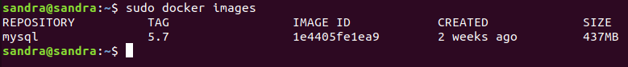

***

**3. TENER ACCESO A LA RED CON EL NOMBRE _MY_NET_.**

- Tras la instalación de docker, se crean 3 redes por defecto en nuestro sistema, para listarlas:

  ```
  sudo docker network ls
  ```
  

  - none: Si queremos que un contenedor no disponga de servicios de red.
  - bridge: Red que se asigna por defecto al contenedor.
  - host:  Permite utilizar la configuración de red de la máquina física que ejecuta el contenedor.

- Procedemos a crear nuestra propia red y verificamos que está bien creada:

  ```
  sudo docker network create my_net
  ```

    ```
  sudo docker network ls
  ```

  

- Para asignar la red a nuestro contenedor, lo podemos hacer de dos formas:

  - Al arrancar el contenedor, añadiendo el comando:

    ```
    --network="my_net" 
    ```
  
  - Con el contenedor arrancado:

    ```
    sudo docker network connect my_net mysql-db
    ```

- Nosotros elegimos la segunda opción, por lo tanto, se la asignaremos más adelante, al arrancar el contenedor.

***

**4. DISPONER DE UN _NAMED DATA VOLUMEN_ DENOMINADO _VOL_MYSQL_ ASOCIADO AL PATH _/var/lib/mysql_ DEL CONTENEDOR.**

- Creamos un **_named data volumen_**. Un _named data volumen_ es un tipo de volumen que no depende de ningún contenedor, por lo que se puede montar en cualquiera de ellos. Hay dos formas de crear volúmenes, al mismo tiempo que ejecutamos el contenedor, o antes. En este caso, elegimos crearlo primero y asignarlo más tarde cuando ejecutamos nuestro contenedor.

  - Creamos el volumen:

    ```
    sudo docker volume create --name vol_mysql
    ```

    

  - Verificamos que se ha creado correctamente:

    ```
    sudo docker volume ls
    ```

    

  - Verificamos su configuración:

    ```
    sudo docker volume inspect vol_mysql
    ```

    


  - Para añadir el volumen a nuestro contenedor, asociándolo al path _/var/lib/mysql_ del contenedor, añadiremos el siguiente comando al arrancarlo:
  
    - -v vol_mysql:/var/lib/mysql (en la primera parte se especifica el nombre del volumen y en la segunda la ruta del contenedor donde queremos que se guarden los datos).

***

 **1. y 2. SER ACCESIBLE A TRAVÉS DEL PUERTO 3306 Y DISPONER DE LAS SIGUIENTES VARIABLES DE ENTORNO:**

    - _MYSQL_ROOT_PASSWORD_: 12345678.
    - _MYSQL_DATABASE_: wordpress.
    - _MYSQL_USER_: wordpress.
    - _MYSQL_PASSWORD_: wordpress.

- Procedemos a crear y ejecutar el contenedor con el siguiente comando:

  ```
  sudo docker run -d -p 3307:3306 --name mysql-db -e MYSQL_ROOT_PASSWORD="12345678" -e MYSQL_DATABASE="wordpress" -e MYSQL_USER="wordpress" -e MYSQL_PASSWORD="wordpress" --network="my_net" -v vol_mysql:/var/lib/mysql mysql:5.7
  ```

  - -d: Para que se ejecute en segundo plano (Deatached Mode).
  - -p: Para especificar, en la parte izquierda, el puerto de nuestra máquina y en la parte derecha, el puerto expuesto por el contenedor (se ha mapeado a un puerto distinto del 3306 porque en mi equipo hay un proceso utilizando ese puerto).
  - --name: Para especificar un nombre al contenedor que se creará (si no especificamos nombre, se le asignará uno aleatorio automáticamente).
  - -e : Para especificar las variables de entorno:

      - _MYSQL_ROOT_PASSWORD_: 12345678 --> Especifica la contraseña del usuario root (necesario para iniciar MySQL).
      - _MYSQL_DATABASE_: wordpress --> Crea una base de datos.
      - _MYSQL_USER_: wordpress --> Crea un usuario.
      - _MYSQL_PASSWORD_: wordpress --> Crea una contraseña para el usuario.

  - --network: Permite asignar al contenedor la red creada anteriormente.
  - -v : Permite asignar un volumen al contenedor, la parte izquierda es el nombre del volumen y la de la derecha la ruta donde se guardarán los archivos.
  - mysql:5.7: Es el nombre de la imagen que vamos a usar (si no nos hemos descargado la imagen en los pasos anteriores, se descargará automáticamente).

    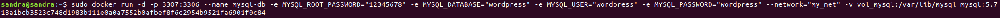

- Cuando ejecutamos el comando, se creará un contenedor que estára en marcha en segundo plano, verificamos que así sea:

  ```
  sudo docker ps
  ```
  

- Para verificar que mysql funciona, podemos entrar al contenedor con el siguiente comando:

  ```
  sudo docker exec -it mysql-db mysql -p
  ```

  - exec: Indica que vamos a pasar un comando.
  - -it: Modo interactivo.
  - mysql-db: Nombre del contendor al que queremos acceder.
  - mysql -p: Comando para entrar en la consola de MySQL con el usuario root. 


- Al ejecutar el comando, nos pide la contraseña del usuario root que hemos creado antes (12345678). Tras introducirla, accedemos a la consola de comandos y verificamos que se ha creado la base de datos y el usuario:

  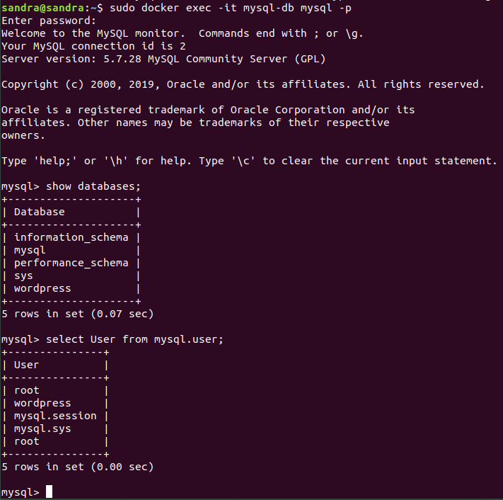


- Una vez esté el contenedor creado y funcionando, podemos verificar si está conectado a la red que hemos creado y si tiene el volumen asociado:

  - Para ver la configuración del contendor:

    ```
    sudo docker inspect mysql-db
    ```

    En la sección Volumes, vemos el volumen asociado y en la de Networks, la red:

    


***

 **SEGUNDA PARTE**

Crear un contenedor con una imagen de _WordPress_ y las siguientes características:

 1. Ser accesible a través del puerto 80.
 2. Disponer de las siguientes variables de entorno:

    - _WORDPRESS_DB_HOST_: 127.0.0.1:3306.
    - _WORDPRESS_DB_USER_: wordpress.
    - _WORDPRESS_DB_PASSWORD_: wordpress.

 3. Tener acceso a la red con el nombre _my_net_.
 4. Disponer de un _named data volumen_ denominado _vol_wordpress_ asociado al
path _/var/www/html_ del contenedor.

***

**0. DESCARGAR LA IMAGEN**

- Búscamos la versión de WordPress a través de la web de _Docker Hub_ _https://hub.docker.com/.linux


  

  Elegimos la versión 5.3.0-php7.2-apache.

- Vamos a la terminal y descargamos la imagen:

  ```
  sudo docker pull wordpress:5.3.0-php7.2-apache
  ```

  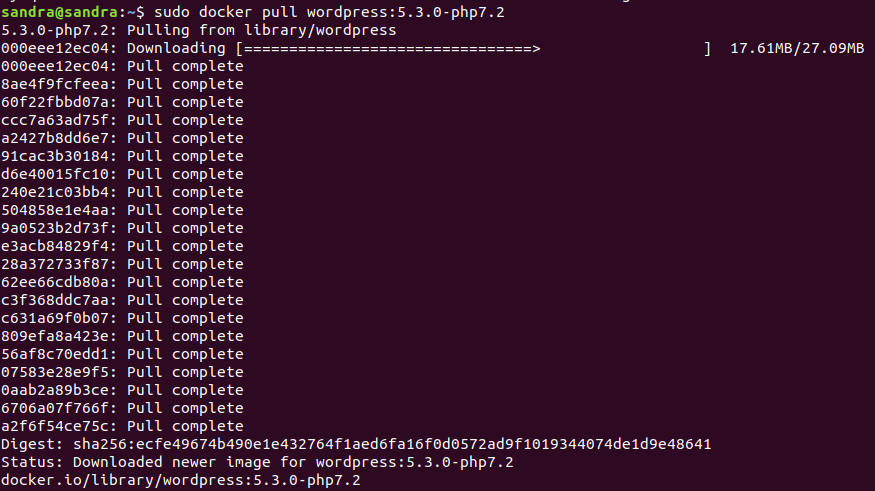

- Consultamos si la imagen se ha descargado correctamente:

  ```
  sudo docker images
  ```

  


***

**3. TENER ACCESO A LA RED CON EL NOMBRE _my_net_.**

 - Utilizaremos la red creada en el punto anterior, asignándola al crear el contenedor.

**4. DISPONSER DE UN _NAMED DATA VOLUME_ DENOMINADO _vol_wordpress_ ASOCIADO AL PATH _/var/www/html_  DEL CONTENEDOR.**

- Creamos el volumen:

  ```
  sudo docker volume create --name vol_wordpress
  ```

  

- Verificamos que se ha creado correctamente:

  ```
  sudo docker volume ls
  ```

  


- Y para ver su configuración:

  ```
  sudo docker volume inspect vol_wordpress
  ```

  

- Lo asignaremos en la creación del cotenedor.

**1. Y 2. SER ACCESIBLE A TRAVÉS DEL PUERTO 80 Y DISPONER DE LAS SIGUIENTES VARIABLES DE ENTORNO:**

- _WORDPRESS_DB_HOST_: 127.0.0.1:3306.
- _WORDPRESS_DB_USER_: wordpress.
- _WORDPRESS_DB_PASSWORD_: wordpress.

Al ejecutar el contenedor, conectaremos wordpress con nuestra base de datos mysql, para ello disponemos de la variable _WORDPRESS_DB_HOST_, donde tenemos que especificar la IP y el puerto por donde se ejecuta nuestra base de datos, para consultarla, vamos a la configuración del contenedor de mysql, a la sección Networks:

```
sudo docker inspect mysql-db
```


Ahora, procedemos a crear y ejecutar el contenedor con el siguiente comando:

```
sudo docker run -d -p 80:80 --name my-wordpress -e WORDPRESS_DB_HOST="172.18.0.2:3306" -e WORDPRESS_DB_USER="wordpress" -e WORDPRESS_DB_PASSWORD="wordpress" -e WORDPRESS_DB_NAME="wordpress" --network="my_net" -v vol_wordpress:/var/www/html wordpress:5.3.0-php7.2
```

- -d: Para que se ejecute en segundo plano (Deatached Mode).
- -p: Para especificar, en la parte izquierda, el puerto de nuestra máquina y en la parte derecha, el puerto expuesto por el contenedor.
- --name: Para especificar un nombre al contenedor que se creará (si no especificamos nombre, se le asignará uno aleatorio automáticamente).
- -e : Para especificar las variables de entorno:

  - _WORDPRESS_DB_HOST_="172.18.0.2:3306" --> IP y puerto del host por donde se ejecuta la base de datos.
  - _WORDPRESS_DB_USER_="wordpress" --> Nombre del usuario de wordpress.
  - _WORDPRESS_DB_PASSWORD_="wordpress" --> Contraseña del usuario de wordpress.
  - _WORDPRESS_DB_NAME_="wordpress" --> Nombre de la base de datos creada anteriormente.

- --network: Permite asignar la red creada anteriormente.
- -v : --> Permite asignar un volumen al contenedor, la parte izquierda es el nombre del volumen y la de la derecha la ruta donde se guardarán los archivos.
- wordpress:5.3.0-php7.2: Es el nombre de la imagen que vamos a usar (si no nos hemos descargado la imagen anteriormente, se descargará automáticamente).


Cuando ejecutamos el comando, se crea un contenedor que está en marcha en segundo plano, verificamos que así sea:

  ```
  sudo docker ps
  ```

  

Accedemos a la página localhost:80 y verificamos que funciona:


***

 **TERCERA PARTE**

1. Especificar el proceso de arranque de cada uno de los contenedores con los distintos comandos utilizados.
2. Una vez arrancados, verificar que se puede realizar el proceso de instalación de wordpress correctamente.
3. Verificar que se puede acceder a mysql desde nuestro pc.
4. Comprobar que si se detienen y se vuelven a arrancar ambos contenedores, no es necesario volver a realizar la instalación de wordpress otra vez.

***

**1. ESPECIFICAR EL PROCESO DE ARRANQUE DE CADA UNO DE LOS CONTENDORES CON LOS DISTINTOS COMANDOS UTILIZADOS.**

  Este punto lo hemos realizado en la primera y segunda parte del ejercicio.

**2. UNA VEZ ARRANCADOS, VERIFICAR QUE SE PUEDE REALIZAR EL PROCESO DE INSTALACIÓN DE WORDPRESS CORRECTAMENTE.**

  Tras elegir el idioma, al final de la parte 2, procedemos a instalar WordPress:

- Rellenamos el formulario:

   

- Nos indica que WordPress se ha instalado:

   

- Para acceder al sitio creado nos pide el login:

  

- Entramos en WordPress:

  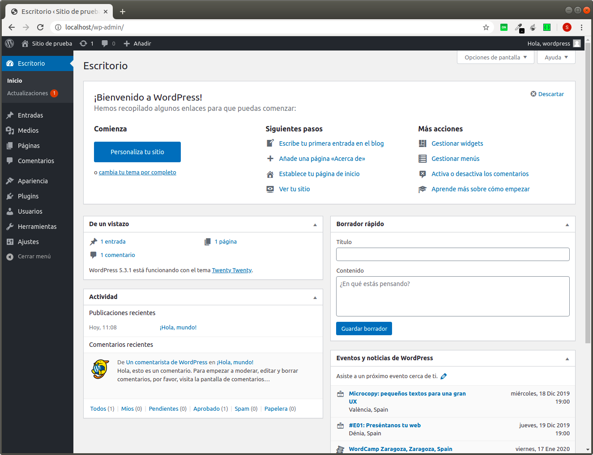

**3. VERIFICAR QUE SE PUEDE ACCEDER A MYSQL DESDE NUESTRO PC.**

   Este punto lo hemos realizado en la primera parte (punto 1 y 2) del ejercicio.

**4. COMPROBAR QUE SI SE DETIENEN Y SE VUELVEN A ARRANCAR AMBOS CONTENEDORES, NO ES NECESARIO VOLVER A REALIZAR LA INSTALACIÓN DE WORDPRESS OTRA VEZ.**

- Paramos los contenedores y lo verificamos

   ```
   sudo docker stop mysql-db
   ```
   ```
   sudo docker stop my-wordpress
   ```
   ```
   sudo docker ps -a
   ```

   

- Los volvemos a arrancar:

   ```
   sudo docker start mysql-db
   ```
   ```
   sudo docker start my-wordpress
   ```
   ```
   sudo docker ps -a
   ```

   

- Volvemos a entrar en _localhost:80_:

   

***

 **CUARTA PARTE**

Crear, por medio de un dockerfile, una imagen basada en una de Ubuntu en la que:

1. Se instale un servidor apache.
2. Se copie el fichero de configuración del sitio principal desde el contexto de docker(directorio donde se encuentra el dockerfile).
3. En dicho fichero de configuración se establecerá una página de inicio (index.html) y otra de error (404.html) que se obtendrán también desde el contexto de docker.
4. Al arrancar esta imagen en un contenedor se debe configurar un volumen que permita acceder a los logs de apache desde el host origen.

***

**0. DESCARGAR LA IMAGEN DE UBUNTU Y CREAR LOS DIRECTORIOS Y ARCHIVOS.**

- Elegimos la versión bionic.

  ```
  sudo docker pull ubuntu:bionic
  ```

  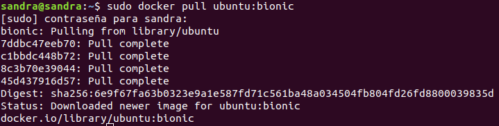

- Verificamos:

  ```
  sudo docker images
  ```

  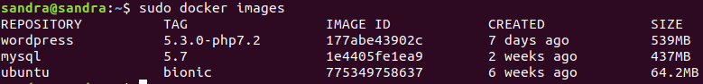

- Creamos un directorio donde alojaremos nuestros archivos (páginas html, archivo de configuración de apache y dockerfile):

  ```
  cd /home/sandra/Escritorio
  ```

  ```
  sudo mkdir ejercicioDocker
  ```

- Damos permisos:

  ```
  sudo chmod 777 ejercicioDocker
  ```

***

**2. COPIAR EL FICHERO DE CONFIGURACIÓN DEL SITIO PRINCIPAL DESDE EL CONTEXTO DE DOCKER (DIRECTORIO DONDE SE ENCUENTRA EL DOCKERFILE).**

Creamos una copia del archivo de configuración default de apache, en nuestro directorio:

- Vamos a la ruta de nuestro equipo donde tenemos tal archivo:

  ```
  cd /etc/apache2/sites-available
  ```

- Copiamos el archivo de configuración a nuestro directorio:

  ```
  cp 000-default.conf /home/sandra/Escritorio/ejercicioDocker/
  ```

- Para sustuir este archivo por el del contenedor de docker, lo haremos más adelante mediante el dockerfile y la orden COPY.

***

**3. ESTABLECER EN EL FICHERO DE CONFIGURACIÓN, UNA PÁGINA DE INICIO (index.html) Y OTRA DE ERROR (404.html) QUE SE OBTENDRÁN TAMBIÉN DESDE EL CONTEXTO DE DOCKER.**

Modificamos el fichero de configuración para añadir las páginas:

  ```
  cd /home/sandra/Escritorio/ejercicioDocker
  ```

  ```
  sudo vim 000-default-conf
  ```

  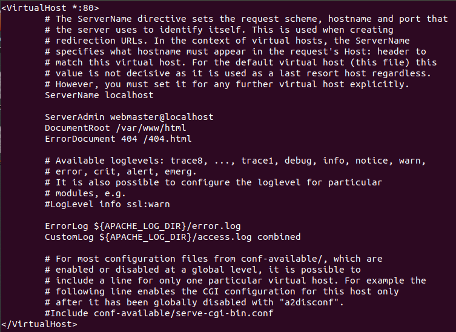


  Directivas:

  - El puerto por el que se sirve el sitio por defecto, es el 80.
  - ServerName: Lo descomentamos, cambiándolo a localhost.
  - DocumentRoot: Lo dejamos tal y como está, porque queremos que los archivos html los coja de la ruta /var/wwww/html (si no existe, se creará).
  - ErrorDocument: Para el error 404, cogerá el archivo 404.html, que estará ubicado en la ruta especificada en DocumentRoot.
  - El resto de directivas las dejamos igual.

Creamos los archivos index.html y 404.html en nuestro directorio:

  ```
  cd /home/sandra/Escritorio/ejercicioDocker
  ```

  ```
  sudo touch index.html
  ```

  ```
  sudo vim index.html
  ```

  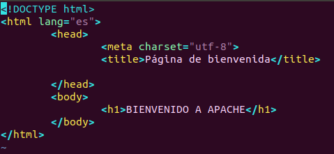

  ```
  sudo touch 404.html
  ```

  ```
  sudo vim 404.html
  ```

  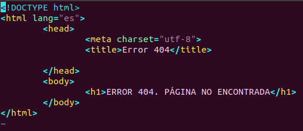

***

**4. AL ARRANCAR ESTA IMAGEN EN UN CONTENEDOR, SE DEBE CONFIGURAR UN VOLUMEN QUE PERMITA ACCEDER A LOS LOGS DE APACHE DESDE EL HOST ORIGEN.**

Utilizaremos un **mounted volume**. Los mounted volumes permiten montar ficheros o carpetas especificando la ruta del host y la del contenedor.

Los logs de apache, por defecto, se guardan en la carpeta /var/log/apache2/access.log.

Como queremos que se guarden en la carpeta de nuestro ejercicio, realizamos lo siguiente:

- Creamos una carpeta dentro de nuestro directorio llamada logs

  ```
  cd /home/sandra/Escritorio/ejercicioDocker
  ```

  ```
  sudo mkdir logs
  ```

- Agregaremos el siguiente comando a la ejecución del contenedor (la primera ruta es la local y la segunda la del contenedor):

  -v /home/sandra/Escritorio/ejercicioDocker/logs:/var/log/apache2
  
- Cuando ejecutemos el contendor más adelante, verificaremos que podemos acceder a los logs desde la carpeta logs de nuestro ejercicio.

***

**1. INSTALAR UN SERVIDOR APACHE.**

Creamos el dockerfile:

```
sudo touch dockerfile
```

```
sudo vim dockerfile
```

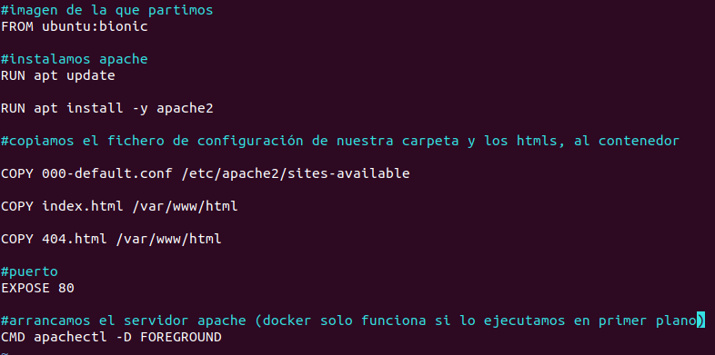


Creamos la imagen a partir del dockerfile:

```
sudo docker build -t ubuntu-image:v.1 .
```

- -t : Damos nombre y tag a la imagen que se creará.
- . : Podemos utilizar sólo un punto, si nuestro dockerfile se denomina dockerfile.


Verificamos que se ha creado correctamente:

```
sudo docker images
```

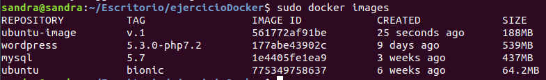

Una vez creada la imagen, creamos y ejecutamos el contenedor:
 
```
sudo docker run -d -p 80:80 --name ubuntu-container -v /home/sandra/Escritorio/ejercicioDocker/logs:/var/log/apache2 ubuntu-image:v.1
```

- -d: Para que se ejecute en segundo plano (Deatached Mode).
- -p: El contenedor funcionará a través del puerto 80.
- --name: Le damos un nombre al contenedor que se va a crear.
- ubuntu-image:v.1: Nombre y tag de la imagen que vamos a utilizar.
- -v: Indicamos las rutas del mounted volume (explicado en el punto anterior).

Verificamos que el contenedor se ha creado correctamente y esté en marcha:

```
sudo docker ps
```

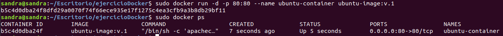


Para ver que funciona, vamos al navegador, a localhost:80


Para visualizar el error 404, especificamos una ruta que no existe (localhost:80/imagenes):

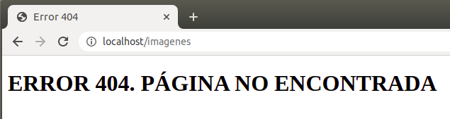

Por último, verificamos que podemos acceder a los logs desde local:

```
cd /home/sandra/Escritorio/ejercicioDocker/logs
```

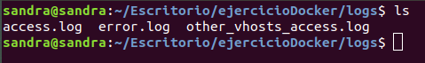

Observamos que tenemos los 3 archivos de logs de apache, si visualizamos el archivo access.log, podremos ver los logs:

```
cat access.log
```

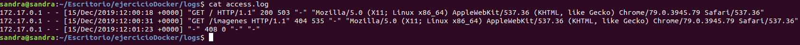

***


 


