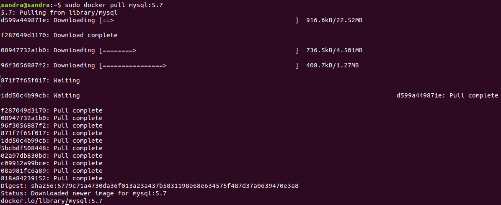
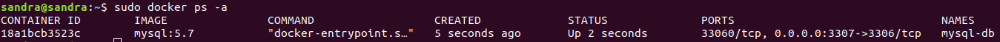

# Práctica Docker

**Enlace a github pages** 

https://sanesga.github.io/practicaApache.gihub.io/

***


***

**Docker** es un proyecto de código abierto que automatiza el despliegue de aplicaciones dentro de contenedores de software, proporcionando una capa adicional de abstracción y automatización de virtualización de aplicaciones en múltiples sistemas operativos. Fue creado en 2013 por la empresa dotCloud y está escrito en Go.

***

**Características**

- Portabilidad: Podemos desplegar el contenedor en cualquier sistema.
- Ligereza: Tiene menos peso que los sistemas de virtualización convencionales (máquinas virtuales).
- Autosuficiencia: Un contenedor contendrá solamente aquellos archivos, librerias y configuraciones que necesite par desplegar las funcionalidades que contenga.

***
**Objetivos de la práctica**

//EDITAR//

Aprender a utilizar Docker, creando contenedores, archivos de configuración y volúmenes.

***

**PRIMERA PARTE**

Crear un contenedor con una imagen de MYSQL y las siguientes características:
 1. Ser accesible a través del puerto 3306.
 2. Disponer de las siguientes variables de entorno:
    - _MYSQL_ROOT_PASSWORD_: 12345678.
    - _MYSQL_DATABASE_: wordpress.
    - _MYSQL_USER_: wordpress.
    - _MYSQL_PASSWORD_: wordpress.
 3. Tener acceso a la red con el nombre _my_net_.
 4. Disponer de un _named data volumen_ denominado _vol_mysql_ asociado al path _/var/lib/mysql_ del contenedor.

***

1. SER ACCESIBLE A TRAVÉS DEL PUERTO 3306 y 2. DISPONER DE LAS VARIABLES DE ENTORNO ESPECIFICADAS.

- Búscamos una imagen de mysql a través de Docker Hub: Podemos hacerlo de dos formas, a través de la web _https://hub.docker.com/_ o a través de la terminal de linux. Necesitaremos ambas maneras:

  **A través de la web** (para poder ver la versión que queremos descargar)

    - Accedemos a la página de Docker Hub:

      


    - Ponemos mysql en el buscador y nos aparece un listado:

      

    - Seleccionamos el primer resultado que es la imagen oficial, la cual se recomienda utilizar. Nos aparece una lista con las versiones disponibles (tags), uno de estos tags es el que utilizaremos desde terminal para descargarnos la imagen.

      

  **A través de la terminal de linux**

- Para buscar la imagen:

  ```
  sudo docker search mysql
  ```

- Nos aparece un listado con todas las imágenes disponibles:

  

  Como podemos ver, en esta lista no se muestran las versiones o tags, por ello hemos accedido anteriormente a la web para consultarlas.

- Elegimos la primera y la descargamos, añadiendo el tag elegido, en nuestro caso el 8.0.18.

  ```
  sudo docker pull mysql:8.0.18
  ```

  Si no especificamos tag, se descargará _latest_ por defecto, aunque esta forma se considera una mala práctica.

  

- Consultamos si la imagen se ha creado correctamente con el siguiente comando:

  ```
  sudo docker images
  ```
  
  


- Una vez descargada la imagen, la ejecutamos especificando los siguientes comandos, junto con las variables de entorno especificadas en el enunciado:

  - -d: Para que se ejecute en segundo plano (Deatached Mode).
  - -p: Para especificar el puerto (3306).
  - --name: Para especificar un nombre al contenedor que se creará (si no especificamos nombre, se le asignará uno aleatorio automáticamente).
  - -e : Para especificar las variables de entorno:
      - _MYSQL_ROOT_PASSWORD_: 12345678 --> Especifica la contraseña del usuario root (necesario para iniciar MySQL).
      - _MYSQL_DATABASE_: wordpress --> Crea una base de datos.
      - _MYSQL_USER_: wordpress --> Crea un usuario.
      - _MYSQL_PASSWORD_: wordpress --> Crea una contraseña para el usuario.
  - mysql:8.0.18: Es el nombre de la imagen que vamos a usar (si no hemos hecho los pasos anteriores y nos hemos descargado la imagen, se descargará automáticamente).

  ```
  sudo docker run -d -p 3306 --name mysql-db -e MYSQL_ROOT_PASSWORD=12345678 -e MYSQL_DATABASE=wordpress -e MYSQL_USER=wordpress -e MYSQL_PASSWORD=wordpress  mysql:8.0.18
  ```
    

- Cuando ejecutamos los comandos, se creará un contenedor que estára en marcha en segundo plano, verificamos que así sea:

  ```
  sudo docker ps
  ```
  

- Para verificarlo, podemos entrar al contenedor con el siguiente comando:

  - exec: Indica que vamos a pasar un comando.
  - -it: Modo interactivo.
  - mysql-db: Nombre del contendor al que queremos acceder.
  - mysql -p: Comando para entrar en la consola de MySQL con el usuario root. 

  ```
  sudo docker exec -it mysql-db mysql -p
  ```
- Al ejecutar el comando, nos pide la contraseña del usuario root que hemos creado antes (12345678). Tras introducirla, accedemos a la consola de comandos y verificamos que se ha creado la base de datos y el usuario:

  


3. TENER ACCESO A LA RED CON EL NOMBRE _my_net_.

- Tras la instalación de docker, se crean 3 redes por defecto en nuestro sistema, para listarlas:

  ```
  sudo docker network ls
  ```
  

  - none: Si queremos que un contenedor no disponga de servicios de red.
  - bridge: Red que se asigna por defecto al contenedor.
  - host:  Permite utilizar la configuración de red de la máquina física que ejecuta el contenedor.

- Procedemos a crear nuestra propia red y verificamos que está bien creada:

  ```
  sudo docker network create my_net
  ```

  

- Para asignar la red a nuestro contenedor, lo podemos hacer de dos formas:

  - Al arrancar el contenedor:

    ```
    sudo docker run -d --name mysql-db --network my_net mysql:8.0.18
    ```
  
  - Con el contenedor arrancado:

    ```
    sudo docker network connect my_net mysql-db
    ```

- Verificamos que la red creada se encuentre en nuestro contenedor (en la sección _Networks_):

  ```
  docker inspect mysql-db
  ```

  


4. DISPONER DE UN _NAMED DATA VOLUMEN_ DENOMINADO _VOL_MYSQL_ ASOCIADO AL PATH _/var/lib/mysql_ DEL CONTENEDOR.

- Creamos un **named data volumen**. Un named data volumen es un tipo de volumen que no depende de ningún contenedor, por lo que se puede montar en cualquiera de ellos. Hay dos formas de crear volúmenes, al mismo tiempo que ejecutamos el contenedor, o antes. En este caso, elegimos crearlo primero y asignarlo más tarde cuando ejecutamos nuestro contenedor.

  - Creamos el volumen:

    ```
    sudo docker volume create --name vol_mysql
    ```

    

  - Verificamos que se ha creado correctamente:

    ```
    sudo docker volume inspect vol_mysql
    ```

    


- Y asociamos el volumen al path _/var/lib/mysql_ del contenedor, añadiéndo a la ejecución del contenedor el siguiente comando:

  - -v: vol_mysql:/var/lib/mysql (en la primera parte se especifica el nombre del volumen y en la segunda la ruta del contenedor donde queremos que se guarden los datos).

  Paramos el contenedor:

   ```
   sudo docker stop mysql-db
   ```

  Lo eliminamos, para volver a crearlo con el volumen asociado:

   ```
   sudo docker rm mysql-db
   ```

  Lo volvemos a crear con la orden completa:

  ```
  sudo docker run -d -p 3306 --name mysql-db -v vol_mysql:/var/lib/mysql -e MYSQL_ROOT_PASSWORD=12345678 -e MYSQL_DATABASE=wordpress -e MYSQL_USER=wordpress -e MYSQL_PASSWORD=wordpress  mysql:8.0.18
  ```


  
 


 **SEGUNDA PARTE**

Crear Un contenedor con una imagen de _Wordpress_ y las siguientes características:
 1. Ser accesible a través del puerto 80.
 2. Disponer de las siguientes variables de entorno:
    - _WORDPRESS_DB_HOST_: 127.0.0.1:3306.
    - _WORDPRESS_DB_USER_: wordpress.
    - _WORDPRESS_DB_PASSWORD_: wordpress.
 3. Tener acceso a la red con el nombre _my_net_.
 4. Disponer de un _named data volumen_ denominado _vol_wordpress_ asociado al
path _/var/www/html_ del contenedor.


